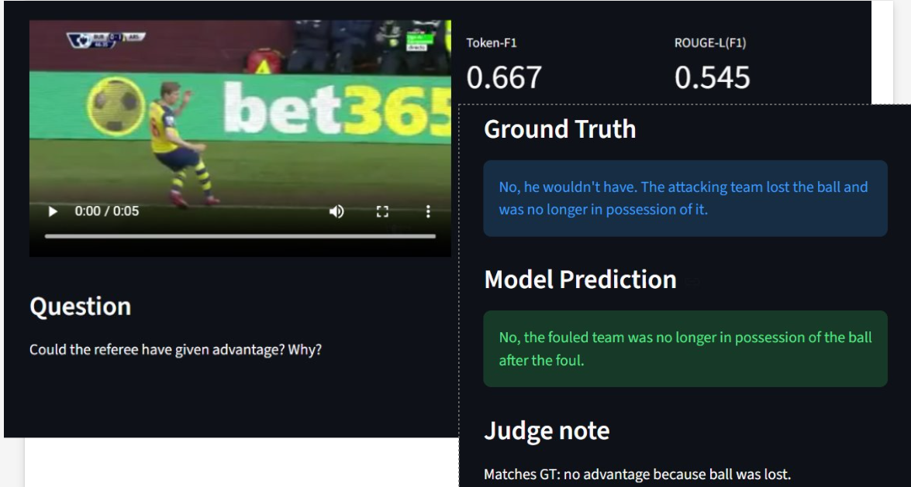

# SoccerChat

## Description
SoccerChat lets users ask questions about uploaded soccer game video clips.

Target audience: soccer fans and broadcasters who want extra info or description.

It uses a Visual Language Model fine-tuned for soccer data.

High-risk item/feature: assessing model performance by computing agreement scores.

## Test Run Images

Test run first: we ran `test va`, which predicts the next token.

## Error Analysis (Start Here)

- Review the 20 worst examples (lowest F1/ROUGE-L or judge score)
- Tag each error type (missed action, wrong actor, hallucinated event, too vague/too long, timing error)
- Count the most frequent error types
- Summarize 2–3 findings for improvement

## De-Risking Checklist (Dr. Landman Style)

- [x] Model runs end-to-end on a small sample
- [x] Inference on test split produces outputs without errors
- [x] Basic evaluation metrics computed (e.g., token F1, ROUGE-L)
- [x] Sanity check: F1 scoring = semantic/token overlap/matching pred vs GT
- [x] Likert scaling: 1 = Strongly Disagree ... 5 = Strongly Agree
- [x] GUI loads and accepts video input
- [ ] Full test split evaluation completed
- [ ] Error analysis on worst cases
- [ ] Performance/latency profiling

## Risk Management Table

| Feature / Capability | Difficulty (1–5) | Risk (1–5) | Status |
|---|---:|---:|---|
| Run model end-to-end | 2 | 3 | ✅ De-risked |
| Test split inference + evaluation | 3 | 4 | ✅ De-risked |
| Agreement scores for evaluation | 4 | 5 | ⚠️ High risk |
| GUI for video + chat | 3 | 3 | ✅ De-risked |
| Large-scale evaluation | 4 | 4 | ⏳ Pending |
| Error analysis & mitigation | 3 | 4 | ⏳ Pending |
